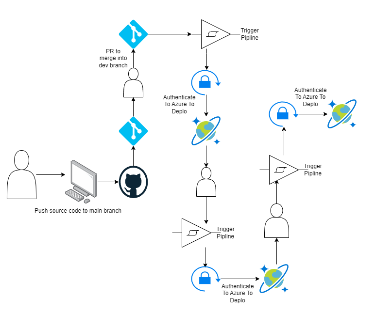

## Title
Deploying Azure CosmosDB In Multlple Environment (dev, stage and prod) using github actions

### Architecture Diagram


## Setup
* Create azure service principle using the command bellow by providing the appropriate permision to the service principle

```bash
az ad sp create-for-rbac \
--name "Github Actions" \
--role $ROLE \
--scopes /subscriptions/$SUBSCRIPTION_ID \
--sdk-auth
```

* Go into your github account -> repository -> settings -> secrets and variables -> actions, then click on `new repository secrets` to create a new secrets
    * The Key => AZURE_CREDENTIALS
    * The Value => the output after runing the first script

* Navigate to Environment in settings and create the following environments
    * dev
    * stage
    * prod

* Add the following secrets in your github account and provide their appropriate values for it.
    * ARM_CLIENT_ID
    * ARM_CLIENT_SECRET
    * ARM_SUBSCRIPTION_ID
    * ARM_TENANT_ID
    * AZURE_CREDENTIALS

* Push your source code to `main` branch.
* Create a pull request to merge from main brain to `dev` branch and wait for a while to see a successfull deployment.
* Create another pull request to merge your dev branch to `stage` branch. Wait for a while to see a new resource deployed in your azure account
* Lastly, create another pull request to merge `stage` to `prod` to create a new resource under production environment.